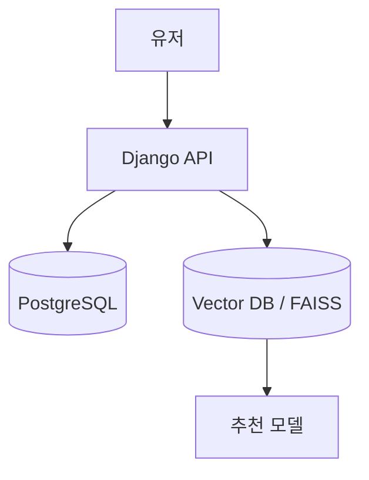

# 📝 연습장 (Practice Note)

자유롭게 아이디어를 적거나 정리하는 공간입니다.

## 1. 아이디어 스케치 (Ideas)
- [ ] 
- [ ] 

## 2. 궁금한 점 (Questions)
- 

## 3. 아키텍처 구상 (Architecture)

```mermaid
graph TD
    User[유저] --> API[Django API]
    API --> DB[(PostgreSQL)]
    API --> VectorDB[(Vector DB / FAISS)]
    VectorDB --> Model[추천 모델]
```

## 4. 메모 (Memo)
- 
